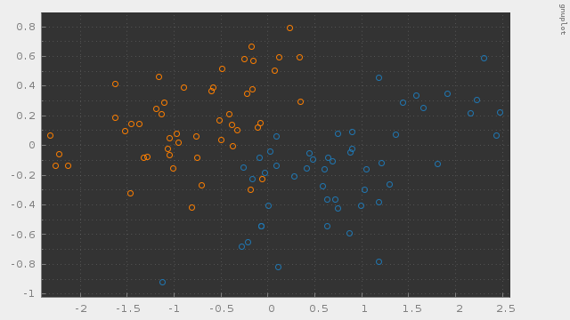
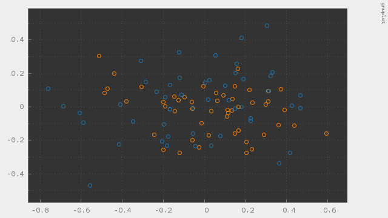

# pca

Principal Component Analysis using Jacobi eigenvalue algorithm

---

#### これは何？

主成分分析(PCA)の実装です。  
アイリスデータの分散共分散行列を求め、PCAで次元削減するコードになっています。  
固有値および固有ベクトルはJacobi法で計算しています。  
C++によるフルスクラッチです。  

##### 動作サンプル

4次元のアイリスデータを2次元に潰してプロットしました。  
固有値の大きい固有ベクトルで潰すとよく分離できています。  

固有値の小さい固有ベクトルで潰すと全く分離できません。  

